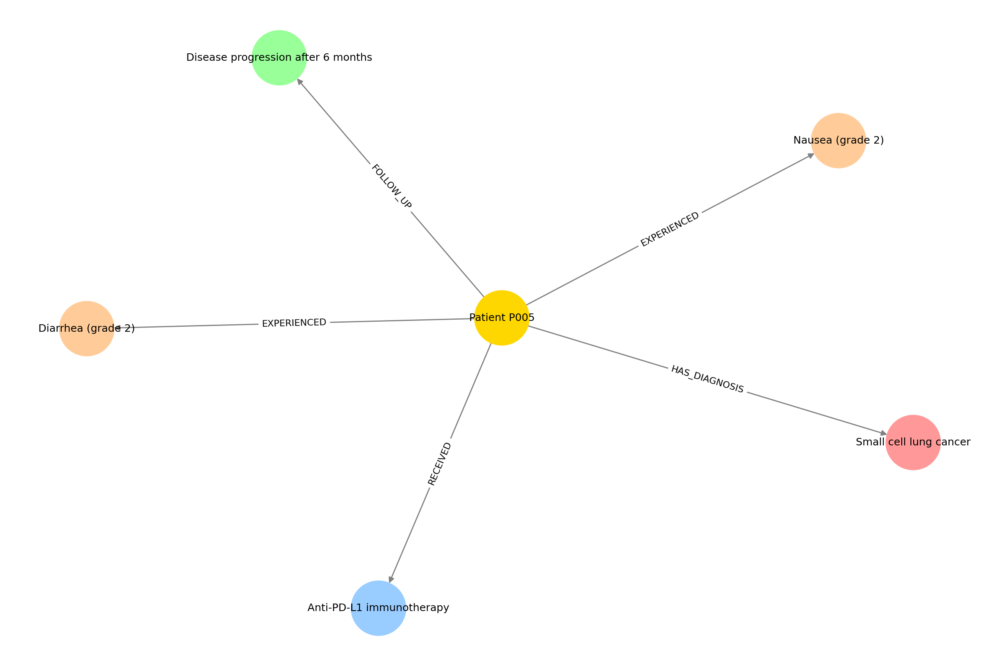

# 🏥 Patient-Level Medical RAG (Lightweight, Structured, Safe)

This repository contains a **lightweight, end-to-end Retrieval-Augmented Generation (RAG)** system designed to work on **medical-style patient reports**.

The project focuses on:
- **patient-level information retrieval**
- **grounded answers with citations**
- **strictly structured JSON outputs**
- **robust validation and guardrails**
- **CPU-friendly execution** (no heavy local models)
- **patient knowledge graph construction (GraphRAG-inspired)**

> ⚠️ **Important**  
> This repository does **NOT** contain real patient data.  
> All PDFs used for testing are **synthetic / fake reports** generated for demonstration purposes only.

---

## 🎯 Project Goals

- Build a **from-scratch medical RAG pipeline** (no LangChain, no black boxes)
- Retrieve information **per patient**
- Prevent hallucinations using:
  - strict prompting
  - schema-based validation
  - post-processing repair
  - explicit guardrails
- Produce **machine-readable medical summaries** (JSON)
- Incrementally build a **patient-level knowledge graph**
- Keep everything **lightweight** and runnable on an older CPU-only machine

---

## 🧠 What This RAG System Does

Given a question like:

> *“What adverse events are mentioned for patient P010?”*

The system will:
1. Retrieve the relevant patient report
2. Extract only the relevant text chunks
3. Ask an LLM **using only those sources**
4. Enforce a **strict medical JSON schema**
5. Validate, normalize, and repair the output
6. Optionally **update a patient knowledge graph**

Example output:

```json
{
  "diagnosis": {
    "value": "Stage III non-small cell lung cancer",
    "evidence": "[S1]"
  },
  "treatment": {
    "value": "Anti-PD-L1 immunotherapy",
    "evidence": "[S1]"
  },
  "adverse_events": [
    {"name": "Diarrhea", "grade": 2, "evidence": "[S1]"},
    {"name": "Arthralgia", "grade": 1, "evidence": "[S1]"}
  ],
  "negated_findings": [
    {"name": "hepatitis", "evidence": "[S1]"}
  ],
  "follow_up": {
    "value": "Stable disease",
    "evidence": "[S1]"
  },
  "other_notes": null
}
````

---

## 🏗️ Architecture Overview

```
PDF Reports (synthetic)
        ↓
Ingestion & Chunking
        ↓
Embeddings (MiniLM, CPU)
        ↓
FAISS Vector Index
        ↓
Patient-filtered Retrieval
        ↓
LLM (Free API)
        ↓
Strict JSON Schema
        ↓
Validation + Guardrails
        ↓
Patient Knowledge Graph (derived)
```

---

## 🧬 Patient Knowledge Graph (GraphRAG-Inspired)

This project builds a **patient-level knowledge graph** as a **downstream artifact** from validated RAG outputs.

* The graph is constructed **only after successful validation**
* Nodes represent:

  * patient
  * diagnosis
  * treatment
  * adverse events
  * negated findings
  * follow-up outcomes
* Edges represent explicit medical relations (HAS_DIAGNOSIS, RECEIVED, EXPERIENCED, etc.)
* The graph is stored as **JSON** and visualized using **NetworkX**

### 📊 Example: Patient Knowledge Graph



*Figure: Knowledge graph built from validated patient-level RAG outputs.*

> ⚠️ The graph is **not used for answering yet**.
> It is a **structured memory layer** and a foundation for future GraphRAG-style retrieval.

---

## 🔐 Safety & Reliability Features

* **No real patient data**
* Strict prompt: *“Use ONLY the provided sources”*
* Explicit **schema validation**
* Automatic repair of common LLM mistakes:

  * missing fields
  * wrong types
  * misplaced negations
* Guardrail preventing hallucinations when a concept is not present in sources
  (e.g. *“Is pneumonitis present?”*)
* Every extracted item must have a **citation**

---

## ⚙️ Tech Stack

* Python 3.10+
* `sentence-transformers` (MiniLM, CPU-friendly)
* FAISS (vector search)
* Free LLM API (Groq / OpenRouter)
* NetworkX + Matplotlib (graph visualization)
* No GPU required
* No heavy frameworks

---

## 📁 Project Structure

```
patient-rag/
├─ src/
│  ├─ ingestion/        # PDF loading + chunking
│  ├─ embedding/        # Embedding + FAISS index
│  ├─ retrieval/        # Vector search
│  ├─ generation/       # Prompting, validation, guardrails
│  ├─ graphrag/         # Patient graph store
│  └─ app/              # CLI entrypoint
├─ scripts/
│  ├─ generate_fake_patients_bulk.py
│  ├─ batch_eval.py
│  └─ visualize_patient_graph.py
├─ assets/
│  └─ patient_P005_graph.png
├─ data/                # Ignored (synthetic data generated locally)
├─ indices/             # Ignored (FAISS index)
├─ README.md
└─ requirements.txt
```

---

## 🚀 Quick Start

### 1️⃣ Create virtual environment

```powershell
python -m venv .venv
.\.venv\Scripts\Activate.ps1
pip install -r requirements.txt
```

---

### 2️⃣ Generate fake patient reports

```powershell
python scripts/generate_fake_patients_bulk.py
```

---

### 3️⃣ Build the index

```powershell
python -m src.ingestion.ingest
python -m src.embedding.build_index
```

---

### 4️⃣ Set API key (free tier)

```powershell
$env:GROQ_API_KEY="YOUR_API_KEY"
```

(Optional, but recommended)

```powershell
$env:HF_TOKEN="YOUR_HF_TOKEN"
```

---

### 5️⃣ Ask a question

```powershell
python -m src.app.ask --question "What adverse events are mentioned?" --patient_id P005
```

---

### 6️⃣ Run batch evaluation

```powershell
python scripts/batch_eval.py
```

---

### 7️⃣ Visualize patient graph

```powershell
python scripts/visualize_patient_graph.py
```

---

## 🧪 What Is Tested

* Multiple patients
* Multiple question types:

  * diagnosis
  * treatment
  * adverse events
  * negated findings
* JSON validity
* Citation correctness
* Guardrail behavior
* Graph consistency

---

## 🚧 Known Limitations

* Reports are **synthetic**
* Single chunk per PDF (by design)
* No OCR
* Vector-only retrieval
* Graph not yet used for answering

---

## 🔮 Possible Extensions

* Graph-augmented retrieval (true GraphRAG)
* Hybrid BM25 + vector search
* Medical ontology alignment
* Temporal reasoning
* Streamlit UI
* Neo4j backend (optional)

---

## 📜 License

MIT License — free to use and modify.

```

---